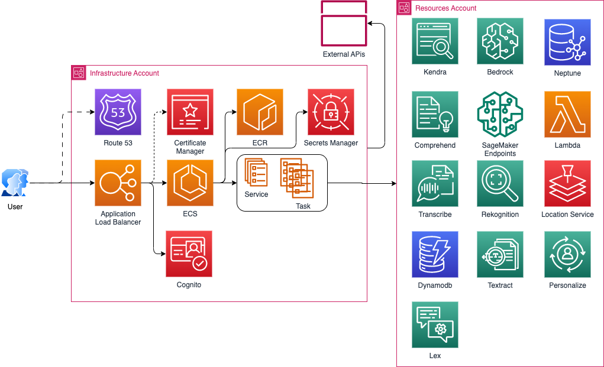

# Generative AI Demo Sandbox

## Description
Site created in the spare time of a cabal of Amazonians.  All demos are accessable via Midway only.  You are free to demo to your customers without prior approval.  Please contact the team if you need non Midway access.

## Environments

### Prod 
[https://aws-gen.ai/](https://aws-gen.ai/)

### Nonprod
[https://staging.aws-gen.ai/](https://staging.aws-gen.ai/)

## Infrastructure Diagram

## Usage

This application, site, demos, and associated code are for demonstration purposes ONLY.  The code here should not be deployed to your production environment without security review.

## Contributing

To contribute, please create a feature branch from development with the name of your demo.  Complete all changes there and submit a PR to the development branch with @rangarap or @dabounds as reviewers at a minimum.  Once the PR is merged, it will be deployed to [Nonprod](https://staging.aws-gen.ai/).

Prod deployments are manual for the time being.

## Support

Contact us on Slack at [genai-demos-support](https://amzn-aws.slack.com/archives/C05B07C4Q2Y)

## Roadmap
 * Singleton Deployments
 * Automation everywhere

## Authors and acknowledgment
Show your appreciation to those who have contributed to the project.

## License
[GNU General Public License v3.0](License.md)

## Project status

Ongoing and ramping